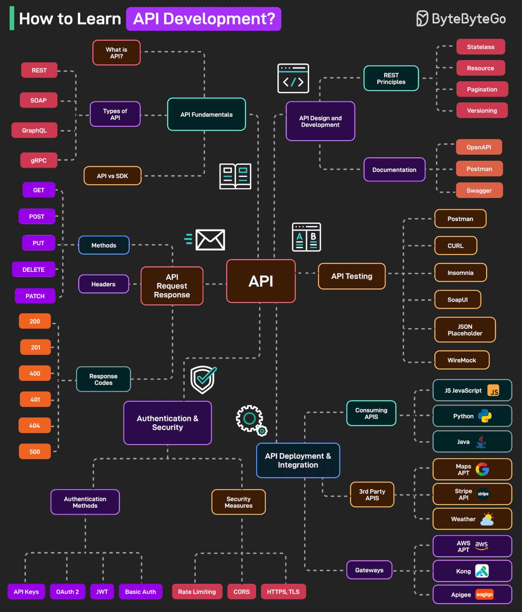

# Візуальний гайд: Як опанувати розробку API

Цей візуальний гайд від ByteByteGo покроково показує, які ключові теми потрібно вивчити, щоб опанувати розробку API 💡

---

## 1. Основи API (API Fundamentals)
→ [**Що таке API?**](./something-api) – розуміння самого поняття API.  
→ [**Типи API:**](./api-types.md) REST, SOAP, GraphQL, gRPC.  
→ [**API vs SDK**](./api-vs-sdk.md) – відмінності між API та SDK.

## 2. Запит і відповідь API (API Request & Response)
→ [**Методи:**](./methods) GET, POST, PUT, DELETE, PATCH  
→ [**Заголовки (Headers)**](./headers) — метаінформація для передачі даних.  
→ [**Коди відповідей:**](./response-codes) 200, 201, 400, 401, 404, 500 тощо.

## 3. Аутентифікація та безпека (Authentication & Security)

### А) [**Методи аутентифікації:**](./authentication-methods)
→ [**API Keys**](./api-keys-description)  
→ [**OAuth 2**](./o-auth-2)  
→ [**JWT**](./jwt)  
→ [**Basic Auth**](./basic-auth)

### Б) [**Заходи безпеки:**](./safety-measures)
→ [**Rate Limiting**](./rate-limiting)  
→ [**CORS**](./cors)  
→ [**HTTPS/TLS**](./https-tls)

## 4. [**Проєктування та розробка API (API Design and Development)**](./api-design-development)
→ **Принципи REST:** Stateless, Resource, Pagination, Versioning.  
→ **Документація:** OpenAPI, Postman, Swagger.

## 5. )[**Тестування API (API Testing)**](./testing)
**Інструменти:**  
→ [**Postman**](./postman.md)
→ [**CURL**](./curl.md)
→ [**Insomnia**](./insomnia)
→ [**SoapUI**](./soap-ui)
→ [**JSON Placeholder**](./json-placeholder)  
→ [**WireMock**](./wire-mock)

## 6. [**Деплой та інтеграція API (API Deployment & Integration)**](./deployment-integration)
→ [**Використання API**](./consuming-apis.md)(Consuming APIs):** JavaScript, Python, Java.  
→ **[**Сторонні API**](./third-party.md)(3rd Party APIs):** Google Maps, Stripe, Weather тощо.  
→ **[**Шлюзи (Gateways):**](./gateways.md)** AWS API Gateway, Kong, Apigee.

---

**Схема охоплює повний цикл роботи з API:**  
_Теорія → розробка → тестування → безпека → інтеграція._

